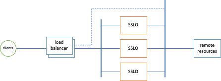
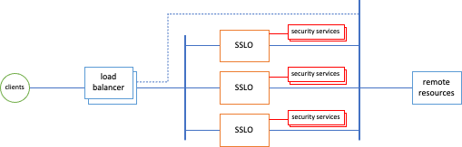
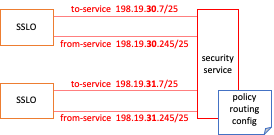
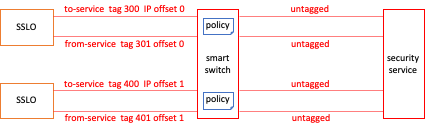
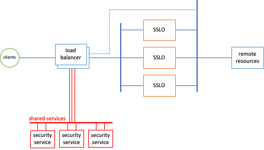

# F5 SSL Orchestrator External Layered Architecture
A set of patterns to address dynamic, high-capacity scaling for decrypted inspection and service chaining.

### SSL Orchestrator version support
These patterns are supported on BIG-IP 14.1 and above, SSL Orchestrator 5.x and above.

### Introduction
Under optimal conditions, an SSL Orchestrator deployment consists of a single HA pair of appliances (or chassis) capable of handling the complete traffic load. However, in the scenario where traffic loads exceed any single-appliance capacity, and/or traffic loads can eventually grow beyond single-appliance capacity, an external layered architecture may be appropriate. The external layered architecture is effectively a set of load balanced SSL Orchestrator appliances.

The key advantages here are that:
- SSL Orchestrator instances can be scaled dynamically to meet increasing traffic load requirements. The frontend load balancer need only handle layer 4, so this architecture can scale up to the total L4 capacity of the load balancer. This architecture can also benefit from other traffic distributions techniques, like Equal Cost Multi-Path (ECMP) routing.
- The frontend steering device can detect a complete outage in the security stack and divert traffic around (*the dotted path in the image above*). This is useful in situations where availability is more critical than inspection.

However, this architecture can present a challenge in the way security devices can be attached. The following sections present three options for handling inspection services in the external layered architecture.

------------------------

<b>Siloed Services Architecture</b>

The easiest and most scalable solution is to "silo" the set of security devices to a single SSL Orchestrator instance. In this scenario, each SSL Orchestrator instance attaches a dedicated set of security devices that are not shared with other instances. While this method does require a larger set of security devices, it provides a much simpler architecture and easier deployment model. The SSL Orchestrator instance and corresponding services can be templated for rapid duplication, and is the preferred way to deploy a scaled environment in public clouds.

In this case, the SSL Orchestrator and respective security products can be identical to other instances, with the following considerations:
- The security devices must be isolated to this BIG-IP instance to prevent unintended routing issues.
- The front-facing listening IP address or VLAN self-IP on the BIG-IP must be unique between the different instances to allow for load balancing.

Otherwise, the SSL Orchestrator instances are "standalone" (non-synced), and configurations can be pushed to these manually, through BIG-IQ central management, or through Ansible automation.

------------------------

<b>Shared Services Architecture</b>

The shared services model allows the security services to be shared between the standalone SSL Orchestrator instances. 

While this model potentially reduces the number of security devices required, it adds some complexity. All *inline* security service traffic through the SSL Orchestrator service chain is **routed**: 

- For inline layer 3 and HTTP devices, SSL Orchestrator routes to the device, and the device is expected to route back on a separate subnet.
- For inline layer 2 devices, SSL Orchestrator routes *across* the device to a BIG-IP VLAN and subnet on the other side of the device.

In all cases, traffic must return to the same BIG-IP. The complexity is thus driven by the type of shared device as follows:

- SSL Orchestrator instances in the external layered architecture are standalone and do not share floating IPs. An **inline layer 3** device must route back to the same BIG-IP, however as there are now multiple return paths (not a single shared floating IP), a layer 3 device must employ a form of policy routing to ensure correct *gateway* return. How this is done is dependent on the layer 3 device, but should optimally policy route (i.e. switch its egress path) based on an attribute of the ingress traffic - for example, the incoming physical interface, or source IP (if enabling SNAT to the service from the BIG-IP). Also, the to-service" and "from-service" IPs and/or IP subnets defined in the SSL Orchestrator layer 3/HTTP service configuration should be different in each instance to provide a unique IP return path from the layer 3 device.

    

- In a shared architecture, **inline layer 2** devices will naturally attach to a switch between the BIG-IP instances and layer 2 devices. For these to work in a shared architecture, it is recommended to configure the "to-service" and from-service" interfaces in the device configuration to use unique tagged VLANs. These tagged VLANs must then correspond to a tagged VLAN on the switch, and the switch must be able to apply policy such that tagged traffic from the BIG-IP is sent untagged to the layer 2 device, and traffic returning from the layer 2 device to the switch is re-tagged (with a different tag) and sent back to the same BIG-IP. Also, while obfuscated, SSL Orchestrator assigns internal IP subnets to each to and from-service VLAN for routing. As with layer 3 devices these IPs must also be unique on each BIG-IP instance. Starting in SSL Orchestrator 7.0, an "Internal IP Offset" option is provided in the layer 2 service configuration. This value must be unique on each SSL Orchestrator instance. 

    

- An **ICAP** security device is a direct client-server negotiation between the BIG-IP and ICAP service, so as long as the VLAN self-IP pointing to the ICAP service is unique on each BIG-IP instance, no other configurations should be necessary.

The external layered archicture with shared services is most effective when using with layer 3 security devices that support some form of easily-configurable policy routing. In this case, scaling the environment involves inserting the BIG-IP, deploying a configuring to the SSL Orchestrator instance with offset service IPs, and defining a policy route configuration on the existing layer 3 devices.

------------------------

<b>Backhauled Shared Services Architecture</b>

The third option extends the shared services model where policy routing and/or smart switching is unavailable or cumbersome. This is accomplished by effectively backhauling security service traffic from the SSL Orchestrator instances to listeners on a separate BIG-IP instance. This could be the same frontent load balancer BIG-IP, or a separate dedicated BIG-IP. The separate BIG-IP is then responsible for attaching and load balancing the individual security services, and performing policy routing back to the correct SSL Orchestrator instance.

This architecture is most effective when sharing services is required, but the external configurations described in the shared services model are overly cumbersome and/or unavailable (ex. a layer 3 service does not support policy routing). For this model to work, each SSL Orchestrator instance again must have offset IPs configured for the service to and from-service networks. The instance points to a single "device" per security service, represented as a unique listener VIP on the separate BIG-IP. That BIG-IP then load balances the security service traffic, and an iRule provides the policy routing back to the correct SSL Orchestrator instance. The configuration and iRule are further described in the following repo, and includes a declarative helper script to assist in building the configuration on the BIG-IP.

https://github.com/kevingstewart/sslo-external-layered-architecture

------------------------

